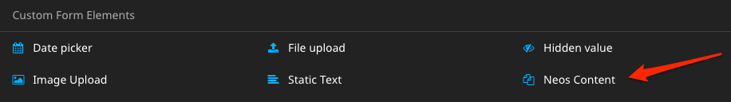
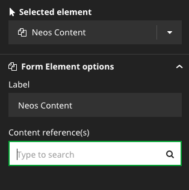

# Render Neos Content in Neos Form Framework Forms

This package adds a new Form Element `Wwwision.Form.ContentReferences:ContentReferences`
to the `default` preset that allows to render Neos Content within Forms
of the [Flow Form Framework](https://github.com/neos/form).

It includes:

* Form Framework Element definition in `Settings.yaml`
* The Fusion definition that is required to render the Content references from a given fusion path
* A Fluid template that will be used when rendering the form with the default `FluidFormRenderer`
* A Fusion prototype that will be used when rendering the form with the `neos/form-fusionrenderer`

## Usage

Install this package using GIT:

```
git clone https://github.com/bwaidelich/Wwwision.Form.ContentReferences.git Packages/Application/Wwwision.Form.ContentReferences
```

And make sure to rescan the installed packages so that it is properly installed:

```
./flow flow:package:rescan
```

**Note:** This package requires the `neos/form-builder` package to be installed

In the Neos backend there's now a new Content Element type that can be
added to node-based Forms:



When selecting the element, Content references can be added in the Property Inspector:



**Note:** This Form Element can't be used outside of node-based Forms because
its rendering relies on the Neos Fusion runtime.

## Disclaimer and further considerations

This package is merely an *example* that should demonstrate how the Form
Framework & Builder can be extended.
I would not recommend to allow editors to add arbitrary content to a Form
but with that package as inspiration it should be easy to include custom
elements.